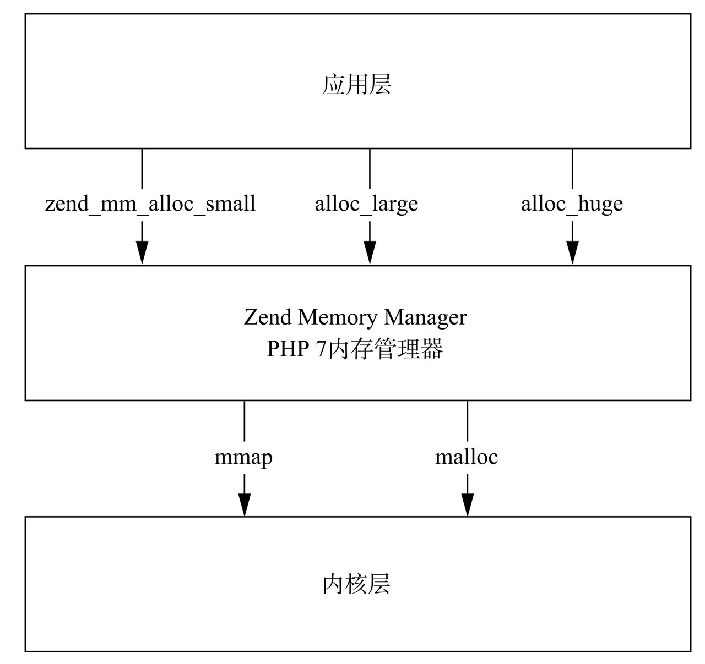

## PHP 内核学习之内存管理
良好的内存管理可以让我们构建的代码更加高效与稳定。相比于C语言需要自己进行内存管理，PHP实现了自己的内存管理器。
### 一 PHP内存管理

    php脚本运行时所需要的内存空间并不是直接从系统直接申请，而是通过Zend内存管理器(Zend Memory Manager)，如果内存管理器中的可用内存够用，则直接分配相应的内存，如果内存管理器不够，再向系统申请。

这种内存申请管理的方式可以减少系统调用的次数，减少用户态和内核态的切换，提高了内存的使用效率
    
### 二 PHP内存管理器的结构


PHP内存池定义了三种模式的内存管理：
* huge （当申请的内存大于或等于2M-4K的内存时）
基本单位： chunk  每个chunk大小为2M  
* large （当申请的内存大于3K，且小于2M-4K的内存时）
基本单位： page，每个page大小为4k，1chunk = 512个page
* small （当申请的内存小于等于3K）
基本单位：slot，内存池提前定义好了30种不同大小的内存（8,16,24,32,3072），不同大小的slot分布在多个连续的page

### 三 基本数据结构

#### 3.1  _zend_mm_heap
变量储存在全局变量alloc_globals(对应的宏是AG)中的mm_heap字段中，其对应的数据类型为——zend_mm_heap。在MM管理器启动时初始化。

```C
struct _zend_mm_heap {
#if ZEND_MM_CUSTOM
    int use_custom_heap;
#endif
#if ZEND_MM_STORAGE
    zend_mm_storage   *storage;
#endif
#if ZEND_MM_STAT
    size_t size; /* 当前使用的内存大小 */
    size_t peak; /* 内存使用的峰值 */
#endif
    zend_mm_free_slot *free_slot[ZEND_MM_BINS]; /* 用来存储small内存 */
#if ZEND_MM_STAT || ZEND_MM_LIMIT
    size_t real_size; /* 当前真正分配的内存大小 */
#endif#
if ZEND_MM_STAT
    size_t real_peak; /* 真正分配的内存大小的峰值 */
#endif
#if ZEND_MM_LIMIT
    size_t limit; /* 内存限制的最大值 */
    int overflow; /* 内存溢出的标识 */
#endif

    zend_mm_huge_list huge_list;   /* huge内存的链表,此处的huge_list存的是所有chunk的链表 */
    zend_mm_chunk main_chunk; /* 正在使用中的chunk的链表 */
    zend_mm_chunk cached_chunks; /* 未使用chunk的链表 */
    int chunks_count;  /* 使用中的chunk的个数，即main_chunk中元素个数 */
    int peak_chunks_count; /* 此次http请求中深情地chunk个数最大值，初始化为1，每次请求开始都会重置为1*/
    int cached_chunks_count; /* 未使用的chunk的个数 */
    double avg_chunks_count; /* 每个请求分配chunk的平均值*/

```
1. huge_list  当申请超过2M的内存时，以chunk为最小单位进行对齐，所有的chunk单向连接后，其头节点的地址储存在在huge_list
2. main_chunk 正在使用的chunk组成的双向链表，main_chunk储存头节点的地址
3. free_slot  指针数组，这个数组中的每个元素对应着未使用的一种规格内存的头结点地址

#### 3.2 _zend_mm_chunk, _zend_mm_page
一个chunk大小为2M，使用的结构体是 _zend_mm_chunk
```C
struct _zend_mm_chunk {
    zend_mm_heap   *heap;    //相应的mm_heap的地址
    zend_mm_chunk  *next;   //下一个chunk节点的地址
    zend_mm_chunk  *prev;    //前一个chunk节点的地址
    uint32_t free_pages;    // 未使用page的个数
    uint32_t free_tail;      // 此chunk上最后一个连续可用page的起始编号
    uint32_t num;            //代表此chunk在main_chunk中的索引*/
    char reserve[64- (sizeof(void*) * 3 + sizeof(int) * 3)];  //保留字段
    zend_mm_heap heap_slot;  /* 只存在main chunk上 */
    zend_mm_page_map free_map; // 标识page的使用情况*/
    zend_mm_page_info map[ZEND_MM_PAGES]; //标识每个page的信息*/
}

struct _zend_mm_page {
    char          bytes[ZEND_MM_PAGE_SIZE]; // ZEND_MM_PAGE_SIZE为4KB
}   
```
##### 3.2.1 MM中chunk的申请流程
每申请一个chunk的时候，MM的处理流程
~~~mermaid
graph LR
    A(申请内存大于2M-4K) ==> B{cached_chunk不为空}
    B -.是.-> C(cached_chunk的头结点摘除)
    C -->D(初始化chunk)
    D -->E(放入main_chunk的尾部)
    B -.否.->F(向操作系统申请新的chunk)
    F-->D
~~~
初始化chunk的流程:
> 1. 将此chunk放入main_chunk链尾 
> 2. 将free_pages的数量-1
> 3. 将free_tail 置为1，因为索引为0的page用于存放chunk结构体的数据
> 4. 将num置为pre节点的num+1 
> 5. 将free_map[0]置为1，标识已经使用了，原因同第三点

#### 3.3 不同大小内存的申请流程

##### 3.3.1 huge模式
huge模式内存申请是通过zend_mm_alloc_huge函数实现的，假设申请大小为size：
>1. 根据内存大小对齐（内存一页为4k），将size计算为要申请的内存长度new_size. 
>2. 调用zend_mm_alloc,申请new_size大小的内存，将申请到的内存按照chunk的大小对齐
>3. 将分配的内存挂载到mm_heap的huge_list上，同时更新peak/real_size等值的大小

##### 3.3.2 large模式
large内存的大小是page的整数倍，通过zend_mm_alloc_pages函数实现的，每次申请都会申请连续多个page：
>1. 遍历main_chunk双向链表 
>2. 判断此chunk中free_pages是否小于page_count,如果小于则跳回（1）
>3. 根据此chunk中page的使用情况free_map,查找最优连续空间page的起始编号page_num,最优原则为：
    a. 连续空闲的page个数最小
    b. 连续空间的page的起始编号最小
如果没有可用的连续空间page,则继续调回（1）
>4. 如果有，则将此chunk的page_num开始的page_count个page对应的free_map中的bit置为1，且将map[page_num]设为 0x40000000 | (page_count<<0) = 0x40000000 |page_count（代表从第page_num起的page_count个page用于large内存），然后用free_pages减掉page_count。

伪代码：
```php
    while($main_chunk->next){
        if($main_chunk->free_pages >= $page_count>){
            if(有可用的连续空间){
                /** 如果有就进行参数设置**/
                break;
            }
        }
        $main_chunk = $main_chunk->next;
    }
```

##### 3.3.3 small模式
内存管理器按照申请内存的大小，将small内存分成了30种规格，每一种规格被称为一个RUN。mm_heap中的heap_slot是一个指针数组，数组中的每个元素都是一种规格的small内存链表。举例大小为100B的small内存的申请流程为：
>1. 100B的大小根据small内存的规格表，详见 zend_alloc_sizes.h，可知，其适用的最小的small内存的num为10.
>2. 如果free_slot[10]为空，则代表此前尚未有此规格带下的内存被申请，因此先去申请1个page,并将此page分为36个大小为112B的内存块，将其中一个内存块返回给申请者，其他的组成单向链表存在free_slot[10]中。同时需要将此page标记为已使用，以及将其用途，以及连续值等信息保存至chunk的map中。
>3. 如果free_slot[10]不为空，则取头结点返回给申请者，将剩余链表继续保存。
